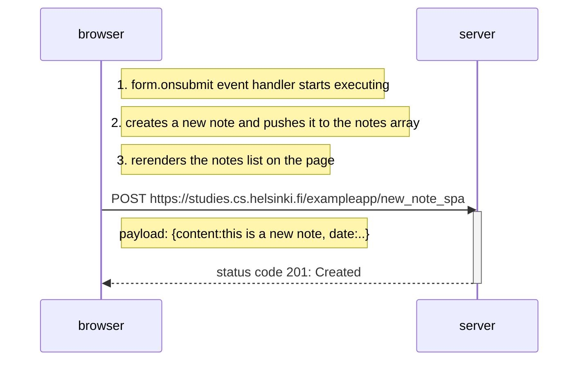

```mermaid
sequenceDiagram
    participant browser
    participant server

    Note right of browser: 1. form.onsubmit event handler starts executing
    Note right of browser: 2. creates a new note and pushes it to the notes array
    Note right of browser: 3. rerenders the notes list on the page
   

    browser->>server: POST https://studies.cs.helsinki.fi/exampleapp/new_note_spa
    activate server
    Note right of browser: payload: {content:this is a new note, date:..}
    server-->>browser: status code 201: Created
    deactivate server
    
```